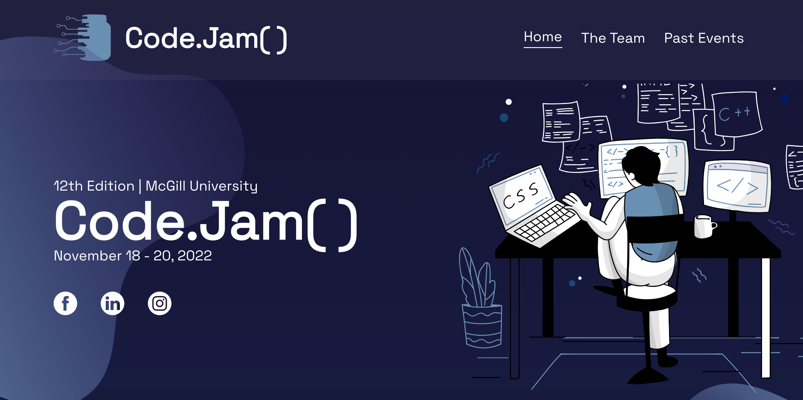

# codejam12
A blog for McGill's CodeJam memories

## Adding a Post
### mMin Page Changes
Add a post to the main page by changing this section of 
the code in **index.html**:
```html
<h3>Title of the first post</h3>
<p> Lorem ipsum dolor sit amet,consectetur adipisicing elit. </p>
```

### Post Page
Add a post-n.html page similar to the ones in **posts** folder. Remeber to configure the link for **Read More** button in the main page and also link the css
stylesheet to the post page.

### Adding an Image
Add your image to the main page by editing the following code snippet in 
**index.html** page:
```html
<div class="image">
    
</div>
```


